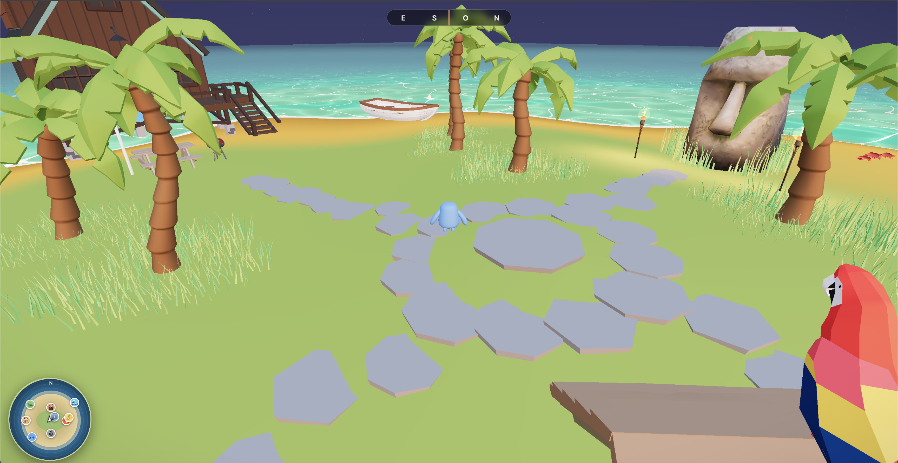

# 🏝️ Tropical Island — Interactive 3D Portfolio

An immersive 3D portfolio experience built with React Three Fiber. Explore a tropical island, discover projects and mini-games through an interactive world with physics, dynamic day/night cycle, post-processing and ambient audio.

**Live demo:** [edoedoedo.it/experiments/tropical-island](https://www.edoedoedo.it/experiments/tropical-island/)



---

## ✨ Features

### World & environment

- 🏝️ **Fully explorable 3D island** — walk, run, jump, explore every corner
- 🌊 **Ocean system** — Perlin noise waves with foam shader
- 🌅 **Dynamic day/night cycle** — sunrise, day, sunset, night with smooth lighting transitions
- ⭐ **Night sky** — animated stars when night falls
- 🌫️ **Atmospheric fog** + post-processing (bloom, vignette, color grading)
- 🌴 **Tropical scenery** — palm trees, bonfire, hammock, surfboards, beach chairs, umbrellas, sand castle, stone paths and more
- 🗿 **Moai statues** with torches and grass
- 🦀 **Animated wildlife** — crabs, turtles, parrots
- 🎬 **Wooden outdoor cinema** with projected video
- 🍃 **Falling leaves**, swaying grass, footsteps and footprint trails
- 🔥 **Positional bonfire** with flames, sparks and dynamic light

### Mini-games

- 🎣 **Fishing** — cast the rod from the rowboat and catch fish
- 🥥 **Coconut catch** — collect coconuts falling from palm trees
- 🔮 **Orb Hunt** — find and collect glowing orbs scattered on the island
- 🏄 **Surf** — ride the waves on the surfboard

### UX & UI

- 🧭 **Compass + minimap** for orientation
- 📋 **HUDs** dedicated to each mini-game
- ⚙️ **Settings panel** — audio volume, graphics quality and options
- 🚀 **Loading screen** with START button
- 📱 **Mobile support** — virtual joystick + touch camera
- 🔊 **Spatial audio** — ambient music + ocean sounds
- 🛡️ **Error boundary** for safe runtime fallback

---

## 🛠️ Tech Stack

| Technology                                                                    | Use                                      |
| ----------------------------------------------------------------------------- | ---------------------------------------- |
| [React](https://react.dev/)                                                   | UI framework                             |
| [React Three Fiber](https://docs.pmnd.rs/react-three-fiber)                   | Three.js renderer for React              |
| [@react-three/drei](https://github.com/pmndrs/drei)                           | Three.js helpers (GLB loader, Sky, etc.) |
| [@react-three/rapier](https://github.com/pmndrs/react-three-rapier)           | Physics engine (Rapier WASM)             |
| [@react-three/postprocessing](https://github.com/pmndrs/react-postprocessing) | Bloom, vignette, color grading           |
| [Three.js](https://threejs.org/)                                              | 3D WebGL rendering                       |
| [Zustand](https://github.com/pmndrs/zustand)                                  | Global state management                  |
| [Leva](https://github.com/pmndrs/leva)                                        | Debug controls (dev only)                |
| [Vite](https://vitejs.dev/)                                                   | Build tool                               |
| [@gltf-transform/cli](https://gltf-transform.donmccurdy.com/)                 | GLB optimization (Draco)                 |

---

## 📦 Project Structure

```
src/
├── App.jsx                       # Entry point, canvas setup, controls
├── main.jsx                      # React bootstrap
├── index.css                     # Global styles
├── assets/
│   ├── Joystick.css
│   └── LoadingScreen.css
└── components/
    ├── Experience.jsx            # Main scene composition
    ├── Scene.jsx                 # Scene wrapper
    ├── Island.jsx                # Island layout (object placement)
    ├── islandLayout.js           # Static positions (trees, crabs, torches…)
    ├── terrainHeight.js          # Terrain height sampling
    │
    ├── CoastalTerrain.jsx        # Procedural terrain + foam shader
    ├── CoastalWater.jsx          # Ocean with Perlin waves
    ├── OceanBarrier.jsx          # Invisible collision wall
    │
    ├── SunsetLighting.jsx        # Directional light + shadows
    ├── SunsetSky.jsx             # Gradient sky shader
    ├── DayNightDriver.jsx        # Day/night cycle driver
    ├── dayNightState.js          # Day/night Zustand slice
    ├── NightStars.jsx            # Night sky stars
    ├── AtmosphericFog.jsx        # Fog effect
    ├── PostFX.jsx                # Bloom / vignette / grading
    │
    ├── CharacterController.jsx   # WASD + physics movement
    ├── Character.jsx             # Animated character mesh
    ├── playerState.js            # Player Zustand slice
    ├── useThrottledPlayerState.js
    ├── Footprints.jsx            # Sand footprint trails
    ├── FootstepParticles.jsx     # Footstep sand particles
    │
    ├── FishingGame.jsx           # Fishing mini-game logic
    ├── FishingGameHUD.jsx        # Fishing UI
    ├── FishingRod.jsx            # Rod model + animation
    ├── FishingBoat.jsx           # Fishing boat
    ├── Rowboat.jsx               # Rowboat model
    ├── fishingState.js
    │
    ├── CoconutGame.jsx           # Coconut catch mini-game
    ├── CoconutGameHUD.jsx
    ├── OrbHunt.jsx               # Orb hunt mini-game
    ├── OrbHuntHUD.jsx
    ├── SurfBoard.jsx             # Surf game logic
    ├── SurfGameHUD.jsx
    ├── surfState.js
    │
    ├── Bonfire.jsx               # Bonfire model
    ├── BonfireFX.jsx             # Bonfire visual FX
    ├── PositionalBonfire.jsx     # Bonfire with positional audio + light
    ├── FlameFX.jsx               # Flame shader/particles
    ├── ParticleSystem.jsx        # Generic particle helper
    ├── FallingLeaves.jsx         # Falling leaves
    ├── Grass.jsx                 # Grass patches
    ├── StonePath.jsx             # Stone paths
    │
    ├── Compass.jsx               # On-screen compass
    ├── Minimap.jsx               # Top-down minimap
    ├── HotZone.jsx               # Trigger volumes for interactions
    ├── Info.jsx                  # In-world info signs
    ├── Modal.jsx                 # Generic modal UI
    ├── SettingsPanel.jsx         # Audio + graphics settings
    ├── LoadingScreen.jsx         # Loading + START screen
    ├── Joystick.jsx              # Mobile joystick
    ├── BackgroundMusic.jsx       # HTML5 ambient audio
    ├── OceanSounds.jsx           # HTML5 ocean audio
    ├── ErrorBoundary.jsx         # Runtime error fallback
    ├── useStore.js               # Zustand root store
    │
    └── [3D Models]               # GLB components
        # Moai, House, PalmTree, Umbrella, Table, ChaiseLounge,
        # BeachChair, SandCastle, Crab, Turtle, Parrot, Hammock,
        # Torch, Grill, Surfboard-1, Surfboard-2, Stone, …

public/
├── models/                       # GLB 3D models (+ _backup originals)
├── sounds/                       # MP3 audio files
├── video/                        # MP4 video files
├── hdrs/                         # HDR environment maps
├── fonts/                        # Custom fonts
├── draco/                        # Draco compression decoder
├── loading-bg.jpg                # Desktop loading background
└── loading-bg-mobile.jpg         # Mobile loading background

scripts/
└── optimize-models.mjs           # GLB optimization (Draco) script
```

---

## 🚀 Getting Started

### Prerequisites

- Node.js 18+
- npm or yarn

### Installation

```bash
# Clone the repo
git clone https://github.com/yourusername/tropical-island.git
cd tropical-island

# Install dependencies
npm install

# Start dev server
npm run dev
```

Open [http://localhost:5173](http://localhost:5173) in your browser.

### Optimize 3D models

Original GLB files live in `public/models/_backup/`. To regenerate the
Draco-compressed versions used at runtime:

```bash
npm run optimize:models
```

---

## 🎮 Controls

| Action                     | Keyboard            | Mobile          |
| -------------------------- | ------------------- | --------------- |
| Move                       | `WASD` / Arrow keys | Joystick        |
| Run                        | `Shift`             | —               |
| Jump                       | `Space`             | Jump button     |
| Interact / Start mini-game | `E`                 | Tap on hot zone |
| Camera                     | Mouse drag          | Touch drag      |
| Settings                   | UI (top right)      | UI (top right)  |

### Mini-games

- 🎣 **Fishing** — go to the rowboat, press interact, time the bite
- 🥥 **Coconut catch** — stand under a palm and collect coconuts
- 🔮 **Orb Hunt** — explore the island to find all orbs
- 🏄 **Surf** — pick the surfboard and ride the waves

---

## 🔧 Development

### Dev Mode with Leva Controls

```javascript
// Island.jsx — top of file
const SHOW_LEVA_CONTROLS = true; // Enable Leva panel for tweaking
```

Available controls:

- 🌊 **Water** — level, wave speed, wave amplitude, foam depth
- 🌅 **Day/Night** — time of day override
- 💡 **Lighting** — sun intensity, color, shadow params

### Add Audio Files

```
public/sounds/
├── ambient-music.mp3   # Background music
├── ocean-waves.mp3     # Ocean ambience
├── bonfire.mp3         # Positional bonfire crackle
└── footsteps.mp3       # Footstep SFX
```

---

## 📦 Build & Deploy

### Build for production

```bash
npm run build
```

### Preview build locally

```bash
npm run preview
```

### Deploy to subfolder (e.g. `/experiments/tropical-island/`)

The `vite.config.js` is already configured with the correct base path:

```javascript
export default defineConfig({
    base: '/experiments/tropical-island/',
    // ...
});
```

Upload the entire `dist/` content to your server subfolder. Add an
`.htaccess` (or equivalent) for correct SPA routing.

---

## 🗺️ Island Map

```
              NORTH [0, Y, +Z]
                    ↑
            🎬 Cinema [0, 3, 25]
                    |
   🏠 House  ←──── ● ────→  🔥 Bonfire
  [-55, 2, 0]   CENTER   [26, 3, 0]
    (-X)           |         (+X)
                   |
            🗿 Moai [0, 7, -25]
                    ↓
              SOUTH [0, Y, -Z]
```

Key zones:

- **Center (0–20m):** Palm trees, parrot, info signs, orbs
- **North (Z+):** Cinema screen, beach chairs, sand castle
- **South (Z-):** Moai, torches, crabs
- **East (-X):** House, grill, table, umbrella, turtle
- **West (+X):** Bonfire, surfboards, hammock, rowboat (fishing)

---

## 📄 License

MIT © [EDOEDOEDO](https://www.edoedoedo.it)
